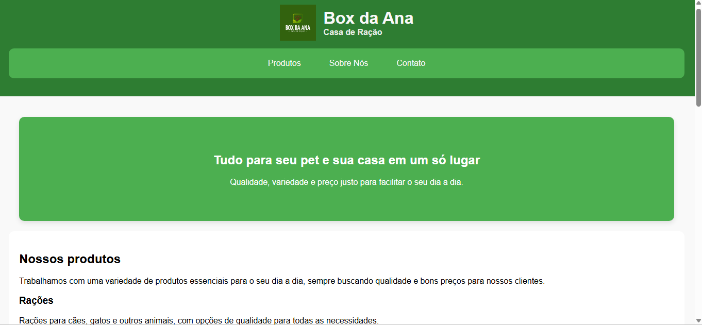

# Box da Ana – Site Institucional

Projeto desenvolvido por **Raiana Pires** com foco em criar um site moderno, funcional e responsivo para uma loja local de ração e produtos domésticos.

---

## Acesse o site

👉 https://raianapiresouza-cloud.github.io/box-da-ana-site

---

## Preview do Projeto

---

## Sobre o projeto

O **Box da Ana** é um site institucional criado para apresentar produtos, informações da loja e facilitar o contato com clientes.

O projeto foi desenvolvido com foco em:

* Experiência do usuário (UX)
* Navegação simples e intuitiva
* Layout limpo e organizado

---

## Tecnologias utilizadas

* HTML5 (estrutura semântica)
* CSS3 (Flexbox e responsividade)
* JavaScript (interatividade e animações)
* Git e GitHub (versionamento)

---

## Funcionalidades

* Navegação com scroll suave
* Animações ao rolar a página
* Layout responsivo (desktop e mobile)
* Estrutura organizada e reutilizável

---

## Responsividade

O site foi adaptado para diferentes tamanhos de tela:

* 📱 Mobile
* 💻 Desktop

---

## Objetivo

Este projeto foi desenvolvido como parte do meu processo de aprendizado em desenvolvimento front-end, com o objetivo de construir aplicações reais e fortalecer meu portfólio.

---

## Desenvolvido por

**Raiana Pires**
🔗 GitHub: https://github.com/raianapiresouza-cloud

---
